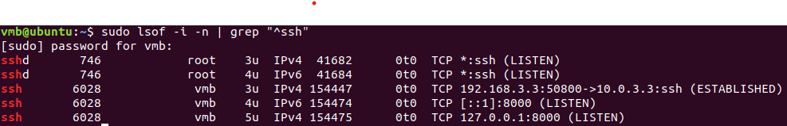
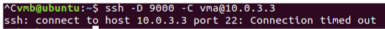
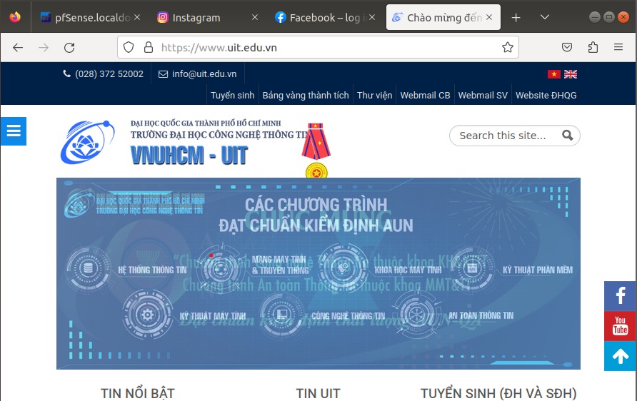

 

# Pfsense Lab Deployment

In this lab, we will deploy and test Pfsense's functionalities, using **VMWare** to simulate our network model.

Table of Contents
=================

* [Pfsense Lab Deployment](#pfsense-lab-deployment)
   * [Setup:](#setup)
      * [Network model:](#network-model)
      * [VMWare network configurations:](#vmware-network-configurations)
      * [VM configurations:](#vm-configurations)
   * [Basic rules:](#basic-rules)
      * [0. Intro:](#0-intro)
      * [1. Block local network (192.168.3.0/24-VM-B) ping to VM-A](#1-block-local-network-1921683024-vm-b-ping-to-vm-a)
      * [2. Block local network (192.168.3.0/24-VM-B) from accessing website using port 80 (HTTP)](#2-block-local-network-1921683024-vm-b-from-accessing-website-using-port-80-http)
      * [3. Block local network (192.168.3.0/24-VM-B) telnet to other areas](#3-block-local-network-1921683024-vm-b-telnet-to-other-areas)
      * [4. Block local network (192.168.3.0/24-VM-B) from accessing facebook.com and youtube.com](#4-block-local-network-1921683024-vm-b-from-accessing-facebookcom-and-youtubecom)
   * [Bypass Firewall by SSH Tunnel:](#bypass-firewall-by-ssh-tunnel)
      * [1. Telnet to VM-A by SSH Tunnel](#1-telnet-to-vm-a-by-ssh-tunnel)
      * [2. How is it possible? Was the packet go through the firewall ? Why did the firewall use this tunnel ? Please explain for me as detail as possible ?](#2-how-is-it-possible-was-the-packet-go-through-the-firewall--why-did-the-firewall-use-this-tunnel--please-explain-for-me-as-detail-as-possible-)
      * [3. Connect to facebook.com by SSH Tunnel with <strong>Proxy configuration</strong>](#3-connect-to-facebookcom-by-ssh-tunnel-with-proxy-configuration)
      * [4. Remove <strong>SSH Tunnel</strong>, clear <strong>Cache data</strong> on browser. Connect to facebook.com again.](#4-remove-ssh-tunnel-clear-cache-data-on-browser-connect-to-facebookcom-again)
      * [5. If on Firewall, we block SSH (port 22). Can we still create tunnel ?](#5-if-on-firewall-we-block-ssh-port-22-can-we-still-create-tunnel-)
   * [Web Proxy Deployment (Application Firewall)](#web-proxy-deployment-application-firewall)
      * [0. Basic config](#0-basic-config)
      * [1. Establish redirection URL](#1-establish-redirection-url)
      * [2. Re-edit Perl code above with condition: when accessing "<a href="http://example.com" rel="nofollow">http://example.com</a>", an blocking-warn image floats in.](#2-re-edit-perl-code-above-with-condition-when-accessing-httpexamplecom-an-blocking-warn-image-floats-in)
   * [VPN](#vpn)
      * [0. Intro:](#0-intro-1)
      * [1. What VPN connection protocols does pfSense Firewall support? What are the difference in their characteristics?](#1-what-vpn-connection-protocols-does-pfsense-firewall-support-what-are-the-difference-in-their-characteristics)
      * [2. Research and configure on pfSense, so that from VM-B, we can open a VPN connection to pfSense server to access VM-A.](#2-research-and-configure-on-pfsense-so-that-from-vm-b-we-can-open-a-vpn-connection-to-pfsense-server-to-access-vm-a)
   * [Backup &amp; Restore (Optional):](#backup--restore-optional)

<!-- Created by https://github.com/ekalinin/github-markdown-toc -->

## Setup:

### Network model:

<p align="center">
     
</p>

### VMWare network configurations:

<center>

| Network Card | Type | Subnet IP | Subnet mask | NAT Gateway |
| ------------ | ------- | ------| ----- | ----- |
| VMnet1 | Host-only | 192.168.3.0 | 255.255.255.0 | N/A | 
| VMnet8 | NAT | 10.0.3.0 | 255.255.255.0 | 10.0.3.2 | 

</center>

On VMware
- Go to "Edit" --> "Virtual Network Editor"  --> "Change Settings" to edit configuration
- In NAT card, go to "NAT Settings", check the "IP Gateway". This IP will let you connect to the Internet, so remember it! In my case is `10.0.3.2`

### VM configurations:

<center>

| Host | VM username | OS image | IP config | Description &nbsp; |
| ----- | ---- | ---- | -----| ----- |
| VM-A | vma | Ubuntu Desktop 18.04 | NAT: <br> 10.0.3.3/24 (static)<br> Gateway: 10.0.3.2 <br> DNS: 8.8.8.8 | <div style="width:380px">Using NAT to access to the Internet, plays role as intermediary to allow `VM-B` to surf websites and Internet services</div> |
| VM- B | vmb | Ubuntu Desktop 18.04 | Host-Only: <br> 192.168.3.3/24 (static)<br> Gateway: 192.168.3.2 | Local PC as guest, access web via `VM-A` |
| pfSense | N/A | pfSense Community Edition (AMD64) | - NAT: <br> 10.0.3.4/24 (static)<br> Gateway: 10.0.3.2 <br> - Host-Only: <br> 192.168.3.2/24 (static)<br> Gateway: N/A | Protect `VM-B` by making proper rules and policies |

</center>

Set static IP for host Ubuntu:
- Click on the network icon on the upper right corner => "Wired Connected" => "Wired Setting"
- In "Wired", click on setting icon
- Switch to "IPv4" tab, choose "Manual", fill in the necessary configurations based on above table
- Reboot the computer (Any changes to network require this)

Install pfsense:
- Download image from the https://www.pfsense.org/download/. Choose the suitable version
- Set up with default settings while installing
- Manually set up interfaces (pfsense will auto-detect the LAN/WAN card after new installation): 
  - Choose option `1`, "Assign Interfaces" -> VLAN setting: `No` -> Pick the right interfaces according to the **MAC address**: On VMware, click "VM" -> "Settings" -> Click on "Network Adapter" of NAT/Host-Only to inspect -> "Advanced" -> Check the **MAC address**
  - Choose option `2` for more configurations. Select the interface to configure:
    - WAN: Input IPv4 address, subnet mask(24), upstream gateway as above table, IPv6: `No`, DHCP: `No`, reverting HTTP: `No`.
    - LAN: like WAN, but nothing for upstream gateway.
  - Choose option `5` to reboot
  - Done !!!

Check and test(3 VMs are up):
- You're able to ping between hosts VM-A <--> VM-B
- Both VMs can access to the internet
- Both VMs and your real host can access to Pfsense site: http://192.168.3.2/

> Note: pfSense also acts as a Router. So routing from `VM-B` to the Internet is available if you configure correctly through `VM-A`. This makes me little confused at the very beginning too :))

Access to http://192.168.3.2/ for basic config on pfSense(user: `admin`; password `pfsense`). Fields that needs to be configured:
- Hostname: `pfsense` (your choice)
- Domain: `localdomain` (your choice)
- Primary DNS Server: `8.8.8.8`
- Secondary DNS Server: `8.8.4.4`
- Timezone: `Asia/Ho Chi Minh` (Your timezone)
- In **Configure WAN interface**
  - Selected Type: `DHCP`
  - Static IP Configuration: \<As the same as above for WAN\>
  - RFC 1918 Private Network: Uncheck **Block RFC1918 private networks**
- In **Configure LAN interface**: \<As the same as above for LAN\>
- Reset the password as you like
- Finished !!!


## Basic rules:

### 0. Intro:

All rules:

<p align="center">
     
</p>

> Note 1: `Block` would drop all the packets that matches the rules, this often make command's output produce nothing. While `Reject` will return an error message and the guest machine receive it clearly, this brings a friendlier experience to user

> Note 2: Rule will be applied from top of the list til below.

> Note 3: When blocking by specifying **ports of a specific service/protocol**, always use `Destination port`. The `Source port` is often randomly created by the OS and therefore, has no reason to be used :>

### 1. Block local network (192.168.3.0/24-`VM-B`) ping to `VM-A`

Rule: 

<p align="center">
     
</p>

- "Save" and then "Apply Changes". Result:

<p align="center">
     
</p>

### 2. Block local network (192.168.3.0/24-`VM-B`) from accessing website using port 80 (HTTP) 

Rule:

<p align="center">
     
</p>

Result:

We're able to access other website using `HTTPS`, `FTP`, ... Example: `facebook.com` uses `HTTPS`. But connecting to [NeverSSL](http://soothingbeautifulwholemelody.neverssl.com/online/) is forbidden as it use `HTTP`

<p align="center">
     
</p>

List of No-SSL websites for testing: [Whynohttps](https://whynohttps.com/)

### 3. Block local network (192.168.3.0/24-`VM-B`) telnet to other areas

- Make sure `VM-A` have already installed Telnet: `sudo apt-get install telnetd`
- Initialize the service: `sudo systemctl restart inetd`
  
Try telnet from `VM-B` to `VM-A`:

<p align="center">
     
</p>

All good! Now creating the rule:

<p align="center">
     
</p>

Disconnect the current telent session by `exit`. Try to make new telnet connection. Result:

<p align="center">
     
</p>
   
### 4. Block local network (192.168.3.0/24-`VM-B`) from accessing `facebook.com` and `youtube.com`

4.1 Approach 1: Creating list of aliases

  - Method 1: 
  
    - Use available  public IP list. You can refer to 2 given lists for [Facebook](https://gist.github.com/Whitexp/9591384)(There are 2 lists in this link, combining both for more accuracy) and for [Youtube](https://github.com/touhidurrr/iplist-youtube/blob/main/ipv4_list.txt).
   
    - Import the IPs to create `Alias`. Move to "Firewall" --> "Aliases". Import the lists, "Type" is `Network` or `Host` (Auto-fill). Example:

   <p align="center">
     
   </p>

  - Method 2: 
    
    - Use `ping` command to get the public IP. `ping` with multiple times to try to get difference IP. For example:<br>
   
  <p align="center">
     
   </p>

   - Then import these IPs. We have no time to get as many IPs as possible. There is a "cheat" way once we've got the very first IP. For example, in this case we have IP `157.240.199.35`. So we wrap it up in a subnet mask, choose a little bit wide enough like `/16`.
    
    <p align="center">
     
   </p>

"Apply Changes" for Alias. Create rule:

<p align="center">
     
   </p>

Both methods generate the same result. We can't use `facebook.com` or `youtube.com` for entertainment purpose now :'((

   <p align="center">
     
   </p>

4.2 Approach 2: Use **DNS Resolver**

\<To be updated\>

## Bypass Firewall by SSH Tunnel:

Make sure we installed `ssh server` and `telnetd` (above) in `VM-A`

```
sudo apt-get install openssh-server
sudo systemctl restart ssh
```

### 1. Telnet to `VM-A` by SSH Tunnel

Creating a SSH Tunnel from `VM-B`. Enter password for `vma`:

```bash
ssh -fN -L 8000:localhost:23 vma@10.0.3.3
```

This command creates an SSH tunnel that forwards local port `8000` to port `23` on the remote host localhost at IP address `10.0.3.3`, using the username ubuntu. The -f and -N flags run the process in the background and prevent the execution of a remote command, respectively.

You can verify the tunnel by:

<p align="center">
     
</p>
   
`sshd` is default when starting the ssh service, owned by `root`. The three remainings that belong to user `vmb` are what we've just created.

(Optional) We can remove this tunnel by kill the process with its process ID. For example, in this case, we use `sudo kill -9 6028`

Explain all flags:

- `f`: Requests ssh to go to background just before command execution.
- `N`: Do not execute a remote command. This is useful for just forwarding ports.
- `L`: Specifies that the given port on the local (client) host is to be forwarded to the given host and port on the remote side. In this case, port 8000 on the local machine will be forwarded to port 23 on the remote host localhost at IP address 10.0.3.3.

Now, we try to use telnet to the bind host `localhost <----> vma@10.0.3.3` with the above bind port `8000 <---> 23`. Remember to enable rule "Block telnet" above.

<p align="center">
     
</p>

We've bypassed the firewall `^w^`. Here are some questions: 

### 2. How is it possible? Was the packet go through the firewall ? Why did the firewall use this tunnel ? Please explain for me as detail as possible ?

First, Yes, the packets would go through the firewall but with a different port number, in this case port `8000`. The firewall rule is blocking Telnet connections on port `23`, but the SSH tunnel is using a different port `8000` for the connection, so the packets are not being blocked by the firewall.

Then, what happened next? Well, after go through port `8000`, our packets will be forwarded to port `23`, right? That's when the magic appears, I means, ... **the SSH mechanism** :0 ... When you connect to the local port `8000`, the connection is **forwarded over the encrypted SSH connection** to the remote host, this makes the pfsense firewall could not figure out the port `23` so there it is. We nailed it !!!

> Theoretically, if `pfsense` have the SSH key and SSH service, it can decrypt the payload and be able to perform filter the packet in this tunnel.

### 3. Connect to `facebook.com` by SSH Tunnel with **Proxy configuration**

- Creating a SSH Tunnel. Enter password for `vma`:

```bash
ssh -D 9000 -C vma@10.0.3.3
```

Explain all flags:

- `D`: Specifies a local "dynamic" application-level port forwarding. This option allows a user to tunnel network connections through an SSH server to bypass firewall restrictions. The port specified, 9000 in this case, is the local port that will listen for connections and forward them through the SSH connection.
- `C`: Specifies compression of data before transmission.
- `vma@10.0.3.3`: The remote hostname and IP address to connect to.

So in this specific example, the command is setting up a **SOCKS proxy** on the local machine at port `9000`, which will forward all traffic to the remote machine at IP address `10.0.3.3`, through an encrypted SSH tunnel as user vma.

- On Firefox, go to "Setting" or access via URL "about:preferences". In "General" tab, go to "Network settings" --> Choose "Settings"
- Configure the proxy as below:

<p align="center">
     
</p>

Then access `facebook.com` again with the "Block-facebook-youtube" rule enabled. Now it works !!!

<p align="center">
     
</p>

### 4. Remove **SSH Tunnel**, clear **Cache data** on browser. Connect to `facebook.com` again.

<p align="center">
     
</p>

### 5. If on Firewall, we block `SSH` (port 22). Can we still create tunnel ?

- Revert the proxy setting to "Use system proxy setting" in Firefox.
- Create new rule:

<p align="center">
     
   </p>

Try to create tunnel again:

<p align="center">
     
   </p>

The answer is "NO" !!!

## Web Proxy Deployment (Application Firewall)

### 0. Basic config

On `VM-A`, install **SQuid Proxy** 

```bash
sudo apt-get install squid -y
sudo systemctl restart squid
```


On `VM-B`, in **Firefox** --> "Network Settings"

<p align="center">
     
</p>

By default, **Squid Proxy** will deny all traffic from accessing websites. Edit `/etc/squid/squid.conf` --> Search for `http_access deny all` --> Re-edit into `http_access allow all`

> Note: Any changes applied in `/etc/squid/squid.conf` need to restart Squid service

On `VM-B`, access to `google.com` for testing. If everything is ok, this should be like this:

<p align="center">
     
</p>

Explain:

We point our proxy directly to **Squid proxy** `VM-A`. So the traffic will not flow through pfSense firewall. That's it !!


### 1. Establish redirection URL

Context: There are some website contains malicious programs or not be included in your organization/school's policies. Try to redirect to another URL.

First, configuring **Squid Proxy** on `VM-A`. Creating a script in `/etc/squid/redirection-script.pl`, written by **Perl**:

```perl
#!/usr/bin/perl -w
use strict;
use warnings;

# Forces a flush after every write or print on the STDOUT
select STDOUT;
$| = 1;

# Get the input line by line from the standard input.
# Each line contains an URL and some other information.
while (<>) {
    my @parts = split;
    my $url   = $parts[0];
    if ( $url =~ /example\.com/ ) {

        # URL Rewriting
        print "http://www.uit.edu.vn\n";
    }
    else {
        # No Rewriting.
        print "\n";
    }
}
```

Explain:

This script reads a file line by line using the `while (<>)` construct. For each line, the script performs the following actions:

- It splits the line into an array of strings using the split function with the default delimiter (a whitespace character).
- It stores the first element of the resulting array in the variable $url.
- It performs a regular expression match on `$url` using the `=~` operator to check if the string "example.com" appears anywhere in $url.
- If the match is successful, the script prints "http://www.uit.edu.vn\n".
- If the match is not successful, the script prints a newline character.

This script can be used to perform URL rewriting on a file containing URLs. If a URL contains the string "example.com", the script replaces it with "http://www.uit.edu.vn". If the URL does not contain the string "example.com", the script leaves it unchanged.

Next, change permission for file execution:

```bash
sudo chmod 777 /etc/squid/redirection-script.pl
```

Finally, edit `/etc/squid/squid.conf` and add two line below:

```
url_rewrite_program /etc/squid/redirection-script.pl
url_rewrite_children 5
```

On `VM-B`, go to http://example.com. Then the webpage will automatically redirect to http://uit/edu.vn like this:

<p align="center">
     
</p>

> Note: **Squid Proxy** default can not process `HTTPS` websites. We need to rebuild the source with suitable flags 

### 2. Re-edit Perl code above with condition: when accessing "http://example.com", an blocking-warn image floats in. 

Change the redirecting path from "http://uit.edu.vn" to "https://i.imgur.com/q8axna8.png" (Image with Stop sign)

```perl
... # The same as above
        print "https://i.imgur.com/q8axna8.png\n";
... # The same as above
```

Restart the service. When you access "http://example.com", the proxy will again redirect you to "http://uit.edu.vn". This 'cause the proxy **Caching** mechanism. To escape from **Caching**, you could:

- Clear cache
- Reconfigure caching
- Using private or incognito mode in browser

I opt for the third as it is more convenient :v Observe the result: 

<p align="center">
     
</p>

The error message "Unsupported Request Method and Protocol" suggests that the Squid proxy is unable to handle the request because it is not a standard HTTP request. The URL "https://i.imgur.com/q8axna8.png" appears to be an **image**, not a **web page**, and it may not be possible to directly access an image through a proxy server. We have to set up `HTTPS` on the proxy.

\<To be updated\>

## VPN 

### 0. Intro:

One of the main functions of a VPN is to create a secure connection that allows connections remote to the local network. VPN feature is also built-in on  pfSense Firewall.

For added security, by default pfSense will enable the "Block private networks and loopback addresses". So we can't do operations like ping to WAN Interface okay. 

Go to "Interfaces" --> "WAN". Uncheck the box:

<p align="center">
     
</p>

Then you are welcomed to `ping 10.0.3.4`

### 1. What VPN connection protocols does pfSense Firewall support? What are the difference in their characteristics?

• Open VPN: highly configurable, secure, supports many encryption algorithms, good performance, be resistant to strong firewalls and  open source.

• L2TP - IP SEC VPN (Layer 2 Tunnel Protocol): L2TP is an *extension of the Point-to-Point Tunneling Protocol (PPTP)* used by internet service providers (ISPs) to enable virtual private networks (VPNs). It does not encrypt the data passing through it, but relies on a set of protocols called `IPsec` to encrypt data before sending, with higher performance and security effectiveness than PPTP, but using **UDP** port **500**, so it is easily blocked by the **NAT firewall**.

### 2. Research and configure on pfSense, so that from `VM-B`, we can open a VPN connection to pfSense server to access `VM-A`.

For Server side:

- Creating Certificate Authority (CA) on PFSense: "System" --> "Certificate Manager" --> "CAs" --> "Add"

<p align="center">
     
</p>

Then "Save"

- Creating Server Certificate for OpenVPN on PFSense: "System" --> "Certificate Manager" --> "Certificates" --> "Add/Sign"

<p align="center">
     
</p>

Then "Save"

- Configure OpenVPN on PFSense: "VPN" --> "OpenVPN" --> "Wizard". Use default configuration, "Next" until "Step 9 of 11". We choose any "Tunnel Network" when traffic flows privately in OpenVPN Tunnel. Here, I choose `10.0.8.0/24`:

<p align="center">
     
</p>

Then, in "Step 10 of 11", "Firewall Rule Configuration":

<p align="center">
     
</p>

"Next" --> "Finished". That's all for server. 

Now let's configure for client side:

- "VPN" --> "OpenVPN" --> "Client" --> "Add". Configure as below:

Your client IP:

<p align="center">
     
</p>

Your `username` and `password` when connecting to VPN

<p align="center">
     
</p>

Data encryption type, choose what you wish ^___^

<p align="center">
     
</p>

- Install "OpenVPN Client Export" to export configuration file for client's use: "System" --> "Package Manager" --> "Available Packages"

<p align="center">
     
</p>

"Install" --> "Confirm"

- Add VPN User: "System" --> "User Manager" --> "Add". Configure as below:

<p align="center">
     
</p>

<p align="center">
     
</p>


- Export VPN configuration with extension: "VPN" --> "OpenVPN" --> "Client Export"

<p align="center">
     
</p>

Now you're good to go (●'◡'●). Transfer this file to `VM-A`. On `VM-A`.

<p align="center">
     
</p>


Install openvpn service:

```bash
sudo apt install openvpn
sudo systemctl restart openvpn
```

Connect to VPN by:

```bash
sudo openvpn --auth-user-pass --config Desktop/pfSense-UDP4-1194-vpn-config.ovpn
```

Enter `username` and `password` on VPN server. DONE !!!

## Backup & Restore (Optional):

Go to "Diagnostics" --> "Backup & Restore" --> Click on "Download configuration as XML" to create a backup configuration for pfSense. Happy enjoy!


